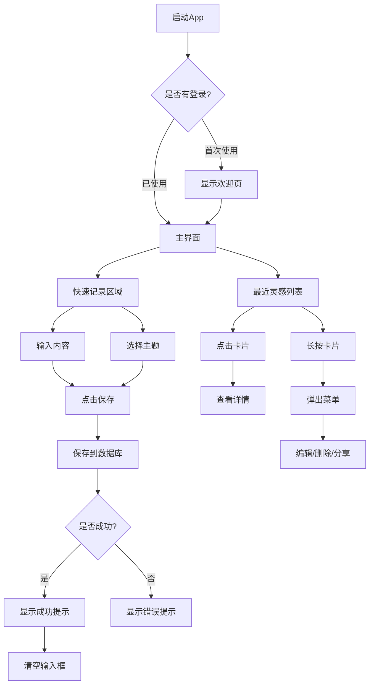
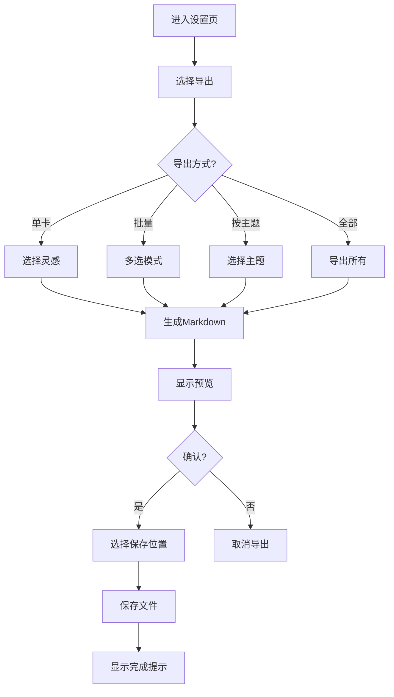

# Sparkle Note - 灵感笔记App设计方案

> 创建时间：2024-01-03
> 版本：v1.0
> 状态：设计中

## 📖 项目概述

**项目名称**：Sparkle Note（灵感笔记）

**项目定位**：一款专注于快速记录灵感、轻量主题归类、支持Markdown导出的Android原生应用

**核心用户场景**：
- 随时随地记录临时灵感和想法
- 为灵感添加主题标签，自动归类整理
- 定期导出备份为Markdown格式
- 通过NAS进行数据备份

---

## 🎯 核心需求总结

| 需求类别 | 具体内容 |
|---------|---------|
| **记录方式** | 纯文本输入，快速记录，最多500字 |
| **主题归类** | 选择现有主题或创建新主题，扁平化结构 |
| **展示方式** | 卡片列表形式，显示内容、创建时间、所属主题 |
| **导出需求** | 单卡、多卡批量、按主题批量、全部内容导出为Markdown |
| **命名规则** | `主题名-内容前10字-时间戳.md` |
| **元数据** | 导出包含主题、创建时间、字数等完整信息 |
| **搜索功能** | 按主题、内容关键词搜索 |
| **数据存储** | Room数据库本地存储，导出JSON格式备份 |
| **平台** | 原生Android应用，Kotlin + Jetpack Compose |
| **UI特性** | 夜间模式支持，Nordic简洁设计风格 |

---

## 🏗️ 技术架构

### 整体架构

采用MVVM架构 + Clean Architecture分层设计：

```
Presentation Layer (UI层)
├── Compose Screens
├── ViewModels
└── UI State

Domain Layer (业务逻辑层)
├── Repository Interfaces
└── Models

Data Layer (数据层)
├── Room Database
├── DAO
└── Repository Implementation
```

### 技术栈

| 组件 | 技术方案 | 版本 |
|-----|---------|------|
| **开发语言** | Kotlin | 1.9+ |
| **UI框架** | Jetpack Compose | BOM 2023.10.01 |
| **数据库** | Room (SQLite) | 2.6.1 |
| **依赖注入** | Dagger Hilt | 2.48 |
| **异步处理** | Kotlin Coroutines + Flow | - |
| **导航** | Compose Navigation | 2.7.6 |
| **构建工具** | Gradle with Kotlin DSL | - |
| **JSON序列化** | kotlinx.serialization | 1.6.0 |

### 项目结构

```
app/
├── data/
│   ├── database/
│   │   ├── InspirationDatabase.kt
│   │   ├── dao/
│   │   │   └── InspirationDao.kt
│   │   └── entity/
│   │       └── InspirationEntity.kt
│   ├── repository/
│   │   └── InspirationRepositoryImpl.kt
│   └── model/
│       └── Theme.kt
├── domain/
│   ├── repository/
│   │   └── InspirationRepository.kt
│   └── model/
│       └── Inspiration.kt
├── ui/
│   ├── theme/
│   │   ├── Color.kt
│   │   ├── Theme.kt
│   │   └── Type.kt
│   ├── components/
│   │   ├── InspirationCard.kt
│   │   ├── ThemeSelector.kt
│   │   └── SearchBar.kt
│   ├── screens/
│   │   ├── main/
│   │   │   ├── MainScreen.kt
│   │   │   └── MainViewModel.kt
│   │   ├── themes/
│   │   │   ├── ThemeScreen.kt
│   │   │   └── ThemeViewModel.kt
│   │   └── export/
│   │       ├── ExportScreen.kt
│   │       └── ExportViewModel.kt
│   └── navigation/
│       └── NavGraph.kt
└── utils/
    ├── ExportManager.kt
    └── BackupManager.kt
```

---

## 💾 数据模型设计

### 1. 灵感实体 (Inspiration)

```kotlin
@Entity(tableName = "inspirations")
data class InspirationEntity(
    @PrimaryKey(autoGenerate = true)
    val id: Long = 0,
    
    @ColumnInfo(name = "content")
    val content: String,                    // 灵感内容，纯文本
    
    @ColumnInfo(name = "theme_name")
    val themeName: String,                  // 主题名称（扁平化设计）
    
    @ColumnInfo(name = "created_at")
    val createdAt: Long = System.currentTimeMillis(),
    
    @ColumnInfo(name = "word_count")
    val wordCount: Int                      // 字数统计
)
```

**设计说明**：
- 采用扁平化结构，主题不作为独立表，直接存储主题名称
- 简化查询，提高性能
- 主题列表通过 `DISTINCT theme_name` 查询获得

### 2. 主题数据类

```kotlin
data class Theme(
    val name: String,                       // 主题名称
    val icon: String = "💡",                // Emoji图标
    val color: Long = 0xFF4A90E2,           // 主题色
    val inspirationCount: Int = 0,          // 灵感数量
    val lastUsed: Long = System.currentTimeMillis()  // 最后使用时间
)
```

**设计说明**：
- 主题信息从灵感数据中动态生成
- 支持Emoji图标和主题色自定义
- 根据`lastUsed`排序显示最近使用的主题

### 3. JSON备份格式

```json
{
  "version": "1.0",
  "exportTime": "2024-01-03T21:30:00Z",
  "appVersion": "1.0.0",
  "themes": [
    {
      "name": "产品设计",
      "icon": "💡",
      "color": "#FF4A90E2",
      "inspirationCount": 15
    }
  ],
  "inspirations": [
    {
      "id": 101,
      "content": "做一个支持离线使用的灵感笔记App...",
      "themeName": "产品设计",
      "createdAt": "2024-01-03T21:30:00Z",
      "wordCount": 45
    }
  ]
}
```

---

## 📱 UI/UX 设计规范

### 设计原则

1. **简洁优先**：界面元素最小化，突出核心功能
2. **快速操作**：常用操作3秒内完成
3. **信息清晰**：内容层次清晰，一眼获取关键信息
4. **一致性**：统一的交互模式和视觉语言

### 配色方案 (Nordic风格)

**夜间模式 (默认)**
```kotlin
val DarkColorScheme = darkColorScheme(
    primary = Color(0xFF4A90E2),        // 北欧蓝
    onPrimary = Color.White,
    secondary = Color(0xFF50C878),      // 薄荷绿
    onSecondary = Color.Black,
    background = Color(0xFF1A1A1A),     // 深灰黑
    onBackground = Color(0xFFE5E5E5),   // 近白色
    surface = Color(0xFF2A2A2A),        // 卡片背景
    onSurface = Color(0xFFE5E5E5),
    surfaceVariant = Color(0xFF333333), // 分割线
    onSurfaceVariant = Color(0xFF888888) // 次要文字
)
```

### 字体规范

| 元素 | 字体 | 大小 | 权重 |
|-----|------|------|------|
| 标题 | Roboto | 16sp | Medium |
| 内容 | Roboto | 14sp | Regular |
| 时间戳 | Roboto | 12sp | Regular |
| 主题标签 | Roboto | 12sp | Medium |
| 按钮文字 | Roboto | 14sp | Medium |

### 间距规范

```kotlin
// 统一间距规范
val Spacing = 
    extraSmall = 4.dp,
    small = 8.dp,
    medium = 12.dp,
    large = 16.dp,
    extraLarge = 24.dp
```

### 卡片设计

**灵感卡片规格**：
- 宽度：屏幕宽度 - 32dp（左右边距）
- 圆角：12dp
- 内边距：16dp
- 阴影：2dp 黑色透明
- 最小高度：80dp

**卡片布局结构**：
```
┌──────────────────────────┐
│ [内容区域]                │
│ 最多显示3行，超出省略号...│
│                          │
│ [底部信息栏]              │
│ 2小时前        💡 产品设计│
└──────────────────────────┘
```

---

## 🔧 核心功能模块详解

### 模块1：快速记录

**功能描述**：
- 主界面默认显示快速记录区域
- 大文本输入框，支持多行输入
- 实时字数统计（0/500）
- 横向滚动的最近主题选择器
- 一键保存，成功后清空输入框

**交互流程**：
1. 用户输入内容
2. 选择主题（可选，默认"未分类"）
3. 点击保存按钮
4. 显示Toast提示"已保存到[主题名]"
5. 输入框清空，准备下一次输入

**技术实现**：
```kotlin
@Composable
fun QuickRecordSection(
    content: String,
    onContentChange: (String) -> Unit,
    selectedTheme: String,
    onThemeSelect: (String) -> Unit,
    onSave: () -> Unit
) {
    // 输入框 + 主题选择器 + 保存按钮
}
```

### 模块2：灵感列表

**功能描述**：
- 垂直滚动的卡片列表
- 支持下拉刷新
- 长按进入多选模式
- 右滑快速删除（带撤销）

**筛选功能**：
- 顶部搜索框，支持关键词搜索
- 横向主题标签筛选
- 时间筛选（今天/本周/本月/全部）

**交互模式**：
- 普通模式：点击打开详情，长按弹出菜单
- 多选模式：批量导出、批量删除

### 模块3：主题管理

**功能描述**：
- 显示所有主题卡片
- 每个主题显示图标、名称、灵感数量
- 点击主题筛选灵感
- 长按编辑主题（名称、图标）
- 支持创建新主题

**主题创建流程**：
1. 点击"+"按钮
2. 底部弹出对话框
3. 输入主题名称
4. 选择Emoji图标（可选）
5. 确认创建

### 模块4：搜索功能

**搜索特性**：
- 实时搜索，无需点击搜索按钮
- 支持内容和主题名称搜索
- 搜索结果高亮显示关键词
- 搜索历史记录（可选）

**性能优化**：
- 使用`LIKE '%keyword%'`查询
- 添加索引优化：`CREATE INDEX idx_content ON inspirations(content)`
- 搜索结果缓存

### 模块5：导出功能

**导出方式**：
1. **单卡导出**：长按卡片 → 分享 → 生成Markdown
2. **批量导出**：多选模式 → 导出选中
3. **按主题导出**：主题详情页 → 导出该主题全部
4. **全部导出**：设置页 → 导出所有数据

**Markdown格式**：

**单卡导出示例**：
```markdown
---
主题: 产品设计
创建时间: 2024-01-03 21:30
字数: 45
标签: #灵感 #移动应用
---

做一个支持离线使用的灵感笔记App，原生开发，支持快速记录和主题归类。
```

**批量导出示例**：
```markdown
# 我的灵感笔记

导出时间：2024年1月3日 21:30
灵感总数：15条
主题数量：3个

## 产品设计（5条）

### 1. 做一个支持离线使用的灵感笔记App...

**创建时间**: 2024-01-03 21:30  
**字数**: 45  
**主题**: 产品设计

做一个支持离线使用的灵感笔记App，原生开发...

---

### 2. 优化卡片展示交互...

...
```

**技术实现**：
```kotlin
object ExportManager {
    fun exportSingle(inspiration: Inspiration): String
    fun exportBatch(inspirations: List<Inspiration>): String
    fun exportToFile(content: String, fileName: String): File
}
```

### 模块6：备份与恢复

**备份功能**：
- 导出JSON格式文件
- 包含完整数据和元数据
- 支持分享保存到NAS
- 自动添加时间戳到文件名

**恢复功能**：
- 选择JSON备份文件
- 解析并导入数据
- 冲突处理策略（跳过重复ID）
- 导入进度显示

**文件名格式**：
```
sparkle-backup-20240103-213000.json
```

**备份文件结构**：
```json
{
  "version": "1.0",
  "exportTime": "2024-01-03T21:30:00Z",
  "totalInspirations": 150,
  "totalThemes": 8,
  "themes": [...],
  "inspirations": [...]
}
```

### 模块7：设置与配置

**设置项**：
- 夜间模式开关（默认开启）
- 默认主题设置
- 存储位置选择
- 自动备份开关（可选）
- 关于App信息

---

## 📊 页面流程图

### 主流程



### 导出流程



---

## 🗓️ 开发计划

### 第一阶段：基础架构（1-2天）

**目标**：搭建项目框架，实现核心数据层

**任务清单**：
- [ ] 创建Android项目，配置Gradle和依赖
- [ ] 配置Hilt依赖注入
- [ ] 创建Room数据库和实体类
- [ ] 实现Repository接口和实现类
- [ ] 创建基础UI脚手架（主题、导航）
- [ ] 设置版本控制和Git仓库

**交付物**：可运行的空项目，数据库可正常操作

### 第二阶段：核心功能（2-3天）

**目标**：实现快速记录、列表展示、主题管理

**任务清单**：
- [ ] 实现快速记录UI和ViewModel
- [ ] 实现灵感列表展示（卡片UI）
- [ ] 实现主题选择器（横向滚动）
- [ ] 实现主题管理页面（创建、编辑、删除）
- [ ] 添加基础搜索功能
- [ ] 实现卡片长按菜单（复制、删除）
- [ ] 添加撤销删除功能

**交付物**：MVP版本，可记录和查看灵感

### 第三阶段：高级功能（2天）

**目标**：实现导出、备份、搜索优化

**任务清单**：
- [ ] 实现ExportManager导出工具类
- [ ] 实现单卡、批量、主题导出功能
- [ ] 添加导出预览对话框
- [ ] 实现JSON备份和恢复
- [ ] 优化搜索性能（添加索引）
- [ ] 实现多选模式（批量操作）
- [ ] 添加时间筛选功能

**交付物**：完整功能版本，支持导出和备份

### 第四阶段：UI优化和测试（1-2天）

**目标**：完善UI细节，测试修复bug

**任务清单**：
- [ ] 实现夜间模式切换
- [ ] 优化卡片动画和过渡效果
- [ ] 添加空状态提示（无灵感时）
- [ ] 优化网络图片加载（如有）
- [ ] 性能优化（列表滚动、数据库查询）
- [ ] 修复已知bug
- [ ] 编写单元测试（ViewModel、Repository）
- [ ] 编写UI测试（主要流程）

**交付物**：可发布的Beta版本

### 预计总工期

- **乐观估计**：5天
- **正常估计**：6-7天
- **包含缓冲区**：8天

---

 ## 📋 完整开发路线图

  ### 第1天：测试修复 + 空状态UI
  ├─ 2小时：修复MockRepository ID问题
  ├─ 4小时：修复MainViewModelTest Hilt问题
  └─ 2小时：实现空状态UI组件

  ### 第2天：主题管理 + 撤销功能
  ├─ 4小时：创建主题管理独立页面（100%测试）
  ├─ 3小时：实现撤销删除功能（100%测试）
  └─ 1小时：集成到主界面

  ### 第3天：时间筛选 + 文件导出
  ├─ 3小时：实现时间筛选功能（100%测试）
  ├─ 5小时：实现真实文件导出（权限+FileManager）

  ### 第4天：导出预览 + 备份恢复
  ├─ 3小时：导出预览对话框
  ├─ 5小时：JSON备份和恢复功能（100%测试）

  ### 第5天：UI优化 + 最终测试
  ├─ 4小时：添加动画和性能优化
  └─ 4小时：完整功能测试和bug修复

---

## 📈 性能指标

### 数据规模

| 数据类型 | 预计规模 | 性能要求 |
|---------|---------|---------|
| 灵感数量 | 500-2000条 | 列表滚动流畅（60fps） |
| 主题数量 | 10-30个 | 即时加载 |
| 单条内容 | < 500字 | 存储和读取 < 100ms |
| 导出数据 | 1000条约5MB | 导出时间 < 5秒 |

### 优化策略

1. **数据库优化**：
   - 为`content`和`theme_name`字段添加索引
   - 使用`Flow`进行响应式更新
   - 分页加载（如需要）

2. **UI优化**：
   - 使用`LazyColumn`进行列表懒加载
   - 卡片使用`remember`缓存状态
   - 图片（如有）使用Coil进行懒加载和缓存

3. **导出优化**：
   - 使用`StringBuilder`构建大型字符串
   - 在IO线程执行文件操作
   - 支持进度显示（大量数据时）

---

## 🔍 测试计划

### 单元测试

- **Repository测试**：验证数据库操作
- **ViewModel测试**：验证UI状态和逻辑
- **ExportManager测试**：验证导出格式正确性

### UI测试

- **记录流程**：输入 → 选择主题 → 保存
- **列表操作**：滚动、点击、长按、删除
- **搜索功能**：输入关键词 → 显示结果
- **导出功能**：选择 → 导出 → 验证文件

### 手动测试清单

- [ ] 快速记录100条灵感，检查性能
- [ ] 创建20个主题，验证筛选功能
- [ ] 导出500条数据，验证时间和文件完整性
- [ ] 在不同Android版本上测试（9、11、13）
- [ ] 测试暗黑/亮色模式切换
- [ ] 测试备份恢复功能

---

## 📚 相关文档索引

- [需求文档](REQUIREMENTS.md) - 详细功能需求
- [API文档](API.md) - 数据库API和导出API
- [测试文档](TESTING.md) - 测试用例和测试计划
- [用户手册](USER_GUIDE.md) - 用户使用指南

---

## 📝 版本历史

| 版本 | 日期 | 作者 | 变更内容 |
|-----|------|-----|---------|
| 1.0 | 2024-01-03 | Kimi CLI | 初始设计方案 |

---

## 🤝 贡献指南

开发流程：
1. 从`main`分支创建feature分支
2. 完成功能并添加测试
3. 提交Pull Request
4. 代码审查通过后合并
5. 更新相关文档

---

## 📄 许可证

本项目采用 MIT License。

---

## ✅ 设计确认清单

- [ ] 技术方案评审通过
- [ ] UI设计稿确认
- [ ] 数据模型确认
- [ ] 核心流程确认
- [ ] 开发计划确认
- [ ] 性能指标确认

确认人：___________  日期：___________
